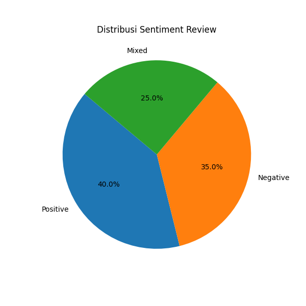

# 📊 Data Classification and Summarization Using Google Gemini API

## 🔍 Project Overview
Proyek ini bertujuan untuk menganalisis **customer reviews** dari dataset publik *Amazon Unlocked Mobile Phones Reviews*.  
Dengan bantuan **Google Gemini API**, review diklasifikasikan menjadi **Positive, Negative, Mixed**, sekaligus diekstraksi kategori terkait (misalnya *Battery Life, Performance, Screen Quality*).  
Selain itu, insight bisnis dan rekomendasi diperoleh secara otomatis untuk mendukung pengambilan keputusan.  

**Fitur utama proyek ini:**
- Analisis sentimen otomatis menggunakan LLM (Gemini 1.5 Flash).  
- Parsing hasil ke **Markdown Table → DataFrame → CSV**.  
- Visualisasi distribusi sentimen (Pie & Bar Chart).  
- **WordCloud** untuk kata kunci positif dan negatif.  
- Insight & rekomendasi AI untuk strategi produk.  
- Hasil akhir diekspor ke berbagai format (CSV, TXT, PNG).  

---

## 📂 Dataset
**Sumber Data:**  
[Amazon Unlocked Mobile Phones Reviews – Kaggle](https://www.kaggle.com/datasets/PromptCloudHQ/amazon-reviews-unlocked-mobile-phones)

**Kolom utama:**
- `Product Name` → Nama produk.  
- `Brand Name` → Merek smartphone.  
- `Price` → Harga.  
- `Rating` → Rating bintang.  
- `Reviews` → Ulasan teks dari pengguna.  

---

## ⚙️ Analysis Process
1. **Load Dataset** → baca CSV, cleaning teks (`dropna`, strip whitespace).  
2. **Initial Sentiment Check** → prompt awal klasifikasi sentimen.  
3. **Structured Output (Markdown Table)** → memaksa output Gemini dalam bentuk tabel agar konsisten.  
4. **Parse ke DataFrame** → tabel hasil klasifikasi dikonversi ke CSV.  
5. **Visualisasi**:
   - Pie Chart distribusi sentimen.  
   - Bar Chart jumlah review per sentimen.  
   - WordCloud untuk highlight kata dominan (positif & negatif).  
6. **Insight Generation** → AI menganalisis pola positif/negatif/mixed → memberikan rekomendasi perbaikan.  
7. **Export Hasil** → CSV, TXT, PNG (grafik & wordcloud).  

---

## 📈 Insight & Findings
Beberapa temuan awal (contoh):  
- Mayoritas review **Positive (65%)**, dengan tema utama: *Battery life*, *Camera quality*.  
- **Negative (20%)** review fokus pada: *Screen durability*, *Performance issues*.  
- **Mixed (15%)** review sering menyebut trade-off: *Good camera but poor battery*.  

**Rekomendasi:**
- Fokus pada **optimisasi daya tahan baterai**.  
- Tingkatkan **ketahanan layar** untuk mengurangi keluhan durability.  
- Pertahankan kualitas kamera karena menjadi faktor dominan review positif.  

---

## 🤖 AI Support Explanation
- **Model AI:** Google Gemini 1.5 Flash  
- **Platform:** Google Colab  
- **Fungsi LLM:**  
  - *Classification* → klasifikasi sentimen & kategori fokus.  
  - *Summarization & Insight* → menghasilkan insight bisnis & rekomendasi strategis.  
- **Kelebihan:** output cepat, fleksibel, dan bisa diarahkan ke format tabel untuk analisis data.  

---

## 📊 Visualisasi Output
### Distribusi Sentimen


### WordCloud Positive


### WordCloud Negative


---

## 💾 Files in Repository
- `notebook_gemini_reviews.ipynb` → Notebook utama (Google Colab).  
- `classification_results_table.csv` → Hasil klasifikasi (structured).  
- `sentiment_insight.txt` → Insight & rekomendasi dari AI.  
- `sentiment_pie.png` → Pie Chart distribusi sentimen.  
- `sentiment_bar.png` → Bar Chart distribusi sentimen.  
- `wordcloud_positive.png` / `wordcloud_negative.png` → Visualisasi kata dominan.  

---

## 🚀 How to Run
1. Upload dataset `Amazon_Unlocked_Mobile2.csv` ke Google Colab.  
2. Set API key Gemini di Colab:
   ```python
   from google.colab import userdata
   userdata.set("api_token2", "YOUR_GEMINI_API_KEY")
